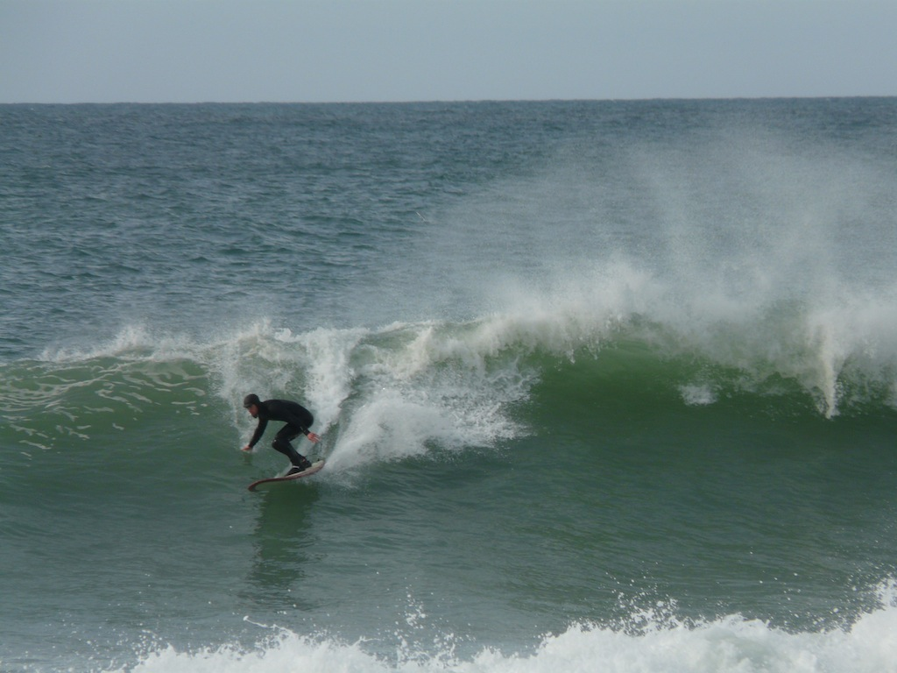

!SLIDE[bg=scene/headon.jpg]
&nbps;

!SLIDE center
# Hello!

!SLIDE[bg=jacob/lalancha.jpg]
# Jacob Burkhart

!SLIDE

.notes TODO: insert a slide with a piece of code from my earlier lightning talk

!SLIDE center
# What is presence?

!SLIDE center
# Awareness

!SLIDE center
# Mindfulness

!SLIDE center
# Focus

!SLIDE[bg=family/alicia.jpg]
# Who here Surfs?

.notes Did you catch that? How do you understand what's going on there? Are you stepping through it line by line.  Mental Ruby Evaluator maybe?

!SLIDE[bg=gerry/pipeline.jpg]
# Gerry Lopez

!SLIDE
# Surf is where you find it

.notes So he wrote this book, and I got about halfway through it. And I picked it up again a week ago and suddenly I got to all the good stories. The ones that really talk about this hippy "Being Present" stuff

!SLIDE center align-left
## Such is the life we can know.
## Living in the past and in the future - in recollection and in anticipation - creates a less clear picture of the present.
## By being in the here and now we understand that the past and future only exist in the present.
## That's all there is, but speaking for myself, I couldn't ask for more.

.notes quote by Gerry Lopez. He was talking about his experience big wave surfing. Fortunately for me, I can get this feeling from less life-threatening situations.

!SLIDE  center
# Surfing

.notes What do you think of when I say surfing?

!SLIDE[bg=surfing/huntingtonbeach.png]
&nbps;

!SLIDE[bg=surfing/huntingtonbeach2.png]
&nbps;

!SLIDE[bg=surfing/slaterusopen.jpg]
&nbps;

!SLIDE[bg=surfing/slaterob.jpg]
&nbps;

!SLIDE[bg=surfing/alanascloset.jpg]
&nbps;

!SLIDE[bg=surfing/alanablanchard.jpg]
&nbps;

!SLIDE[bg=surfing/teahupoo.jpg]
&nbps;

.notes http://en.wikipedia.org/wiki/Teahupo'o

!SLIDE[bg=surfing/mavs.jpg]
&nbps;

!SLIDE[bg=surfing/jeffclark.jpg]
&nbps;

!SLIDE[bg=surfing/danereynolds.jpg]
&nbps;

!SLIDE[bg=surfing/rellsunn.jpg]
&nbps;

!SLIDE[bg=surfing/kassiameador.jpg]
&nbps;

.notes Growing up at Malibu and surfing there, I was able to see some of the best surfers in the world. I am a very visual person. That’s why I am into photography and I really enjoy films. So aesthetically, I will just like the way someone surfs, especially if they are smooth. That’s why I like how Joel (Tudor) surfs or someone like Dane Peterson. A smooth style is something that I appreciate and I want to emulate with my surfing. I really have a difficult time watching people surf when they are just “all over the place,” I just can’t visually accept it. (laughs)

!SLIDE[bg=surfing/hippies.jpg]
&nbps;

!SLIDE[bg=surfing/hippies2.jpg]
&nbps;

!SLIDE[bg=surfing/zenhippy.jpg]
&nbps;

!SLIDE[bg=friends/jorge.jpg]
&nbps;

!SLIDE[bg=surfing/treepose.png]
&nbps;

!SLIDE[bg=surfing/hampton-nh.jpg]
&nbps;

!SLIDE
# Kook
<table>
  <tr>
    <td>
      
    </td>
    <td rowspan="100%">
      
    </td>
  </tr>
  <tr>
    <td>
      
    </td>
  </tr>
</table>

.notes Everyone starts as a beginner. But even the most experience surfers have kook moments

!SLIDE[bg=surfing/jettykooks.jpg]
# Kooking it up

.notes http://surfergrrrl.blogspot.com/2012/07/social-sunday-sloppy-surf-hmb-jetty.html

!SLIDE[bg=gerry/yoga.jpg]
# Gerry Lopez
                 
(not a Kook)

.notes You seem him talking in surf movies, and he's just so relaxed and Zen. I envy his vibe.

!SLIDE[bg=gerry/g-land.jpg] bullets incremental
# G-Land
* Grajagan Bay, Indonesia
* The ocean always wins

.notes Surf is where you find it page 128.  Gerry tells the story of riding giant unpredictable waves in G-Land. http://en.wikipedia.org/wiki/G-Land

!SLIDE center align-left
## Sometimes we have to back to the beginning to find the answers to the questions we have at the end.
## The answers may be so simple that it is easily overlooked.
## If one believes that the truth lies within, faith dictates that it will reveal itself when it is most needed.
## It's there, so keep padding where it leads.

.notes page 128

!SLIDE
# We have kook moments in programming too

    @@@ruby bigcode
      if value == true
        return true
      else
        return false
      end

!SLIDE
    @@@ruby
    def traversal_from_hash(from_hash)
      traversal = Proc.new do |hash_a, hash_b, opts1|
        a_vals = []
        b_vals = []
        sub_procs = [Proc.new{ "" }]
        hash_a.each do |key, value|
          if (value.is_a?(Hash) && hash_b[key].is_a?(Hash))
            sub_procs << Proc.new do |opts2|
              traversal.call(value, hash_b[key], opts2)
            end
          else
            unless hash_b[key].nil?
              a_vals << value
              b_vals << hash_b[key]
            end
          end
        end
        sub_proc = Proc.new do |opts3|
          sub_procs.collect do |sp|
            sp.call(opts3)
          end.join("")
        end
        a_vals.uniq.collect do |a_val|
          yield a_val, b_vals, sub_proc, opts1
        end
      end
    end

.notes Usually mine involve instance_eval and going down other overly complex rabbit holes when a simple Method or Class would do just fine. This is why we pair. But also, this is healthy. This is good for us.  The ocean always wins and humility is healthy.

!SLIDE[bg=ed/stylecrouch.jpg]
# Getting to the next level

!SLIDE[bg=scene/mainewinter.jpg]
# Dedication

.notes I've taken many people out for their first surf. Or first few surfs. Only a few have truly taken to it.  Made it a priority.

!SLIDE[bg=scene/bocabarranca.jpg]
# Priorities

!SLIDE bullets incremental
# The 5 Priorities
* Faith
* Health
* Family
* Friends
* Work

.notes I don't have the great big grey Gandalf beard up here to really sell this to you like it's a lifetime of wisdom. But I buy into it.

!SLIDE[bg=jacob/esterillos.jpg]
# Faith = Surf

.notes Faith means many thinks to different people. To me it's surfing.  It's that rare sense of connection with the universe.
.notes this is an assignment, not an assertion. I've chosen this assignment for my faith.

!SLIDE[bg=friends/jorge2.jpg]
# Balance

.notes this is an ordered list, but there are no absolutes.  Friends don't ALWAYS take priority over work. There is balance

!SLIDE[bg=faith/buddha.jpg]
# The Buddha

.notes The original Zen master.  Life story is basically. Extreme Decadence, Extreme Piety. The Middle Path.
.notes TODO: where are the picture of surfing in the Philippines! (and Hong Kong statue of Buddha)

!SLIDE[bg=family/jbirdwin.jpg]
# Health

.notes Surfing is good for you
.notes good for your wrists. TODO: good for so many thing
.notes Vitamin D

!SLIDE[bg=family/thanksgiving.jpg]
# Family

!SLIDE[bg=family/shiva.jpg]
# Shiva

.notes Not the indian God, just the middle name my Yoga-obsessed aunt gave to my cousin. Which he now goes by Took my on my first Surf. He was living in a shack his artist friend built, with ilegal plumbing. Over worked as an architect, on the fritz with his girlfriend at the time. Surfing every morning. Loving Life.

!SLIDE[bg=family/jbird.jpg]
# J-Bird

.notes My lifelong surf companion. My Wife. An Obsession with perfection.  And with surfing.
A roller-coaster of emotion as an Addict who rages at the need to surf. And is SOO excited when she finally catches that first wave. Her stoke never fades.

!SLIDE[bg=friends/beachkooks.jpg]
# Friends

!SLIDE[bg=friends/cynthia.jpg]
#Cynthia

.notes Surfing is My Drug

!SLIDE[bg=friends/chris.jpg]
#Chris

.notes keeps me sane (or less insane)

!SLIDE[bg=friends/post-mago-surf.jpg]
#Post-Mango Surf

!SLIDE
# Work
(surf before you go to work)

!SLIDE[bg=ed/yellow.jpg] align-left
# Ed

.notes I knew him as "Director of engineering". Opened my eyes to surfing new places, exploring. Surfing in the winter. Trying new boards One of the first time's Ed and I surfed together I can only recently started at Brontes.  He asked me "How are things"? I said "which, work? or surf?" He replied, oh well surf I guess. Clearly you understand what's more important.
.notes It's critical to always mix work and surfing. The yellow board, a big hull shaped by Ryan Lovelace, was picked up while I was in LA, repairing COSs and meeting customers. I rode it at Ricon, County Line, Topanga Canyon and Cardiff Reef. In between each session, I repaired a COS. It's more complicated than sending a tech or paying shipping on a new board, but, that's far less satisfying.

!SLIDE align-left
## It's critical to always mix work and surfing.
## The yellow board, was picked up while I was in LA, repairing COSs and meeting customers.
## I rode it at Ricon, County Line, Topanga Canyon and Cardiff Reef. In between each session, I repaired a COS.
## It's more complicated than sending a tech or paying shipping on a new board, but, that's far less satisfying.

!SLIDE[bg=scene/sanpancho.jpg]
# Surf Lifestyle

!SLIDE[bg=scene/phillipine-sunrise.jpg]
# Wake up at 6

!SLIDE[bg=scene/lindamar.jpg]
# In the water by 7

!SLIDE[bg=scene/dunes.jpg]
# Out by 9

!SLIDE
# 10 am standup

!SLIDE[bg=jacob/lunch.jpg]
# The Massive Lunch

!SLIDE[bg=jacob/layback.jpg]
# The Joy of Living

.notes pair says: OMG this bug or this problem :-( I say: OMG this bug! :-) It's so interesting. So intriguing. why why why. how how how.

!SLIDE[bg=jacob/safari.jpg]
# Weekend Surf Safari

.notes Lets go surfin now. Everybodys learning how. Come on and safari with me.

!SLIDE[bg=scene/tunitas.jpg]
# The Coastline

.notes Marin county. The usual weekday breaks. State Parks.  Santa Cruz

!SLIDE[bg=scene/santacruz.jpg]
# Santa Cruz

.notes The long peeling waves. Sweet Sweet longboard rides. Otters! But the people :-(

!SLIDE
# Don't be Aggro!

.notes PSA. Don't be the 1% that ruins surfing for the rest of us. They are like the trolls on the internet, except instead of hiding behind anonymity they hide behind a facade of "being local", and "a better surfer than you". But don't be an idiot either

!SLIDE[bg=scene/cowells.jpg]
# Surf etiquette

!SLIDE
#Don't drop in!

!SLIDE
#Priority to the peak

!SLIDE
#Control your board

!SLIDE
#Accidents happen

!SLIDE
#Ding Repair
(picture of Rich)

!SLIDE
#The Aloha spirit

.notes Cheer for strangers. Share the waves.

!SLIDE[bg=beginners/stoked.jpg]
# Learn to Surf

Goofy or Regular

paddling

the pop up

cover your head

hold your breath

!SLIDE
#The hold down

!SLIDE
#Gerry's story of 3 wave hold down

Momments of surf realization are here to remind us of our true potential. If that is why we surf, that's goo because surfing reconnects us to who we really are. This is all more reason to keep surfing. Life is good. Surfing reminds us of how good life is.

.notes page 115

!SLIDE
#Big Waves

!SLIDE
#Mavericks

!SLIDE
#Don't panic after you've panic'd
(picture of grant twiggy baker)

!SLIDE
#Gerry's story of pipeline focus

!SLIDE
#Perrin's Story
patience
"No other thoughts in my head"

!SLIDE
#Darren's Story
Interviewed at facebook. But you know, I have a pretty sweet life...

!SLIDE
#Priorities!

!SLIDE
#Be ready when the surf is up

!SLIDE
#Be patient when it's not

!SLIDE
#Find your style

!SLIDE
#Presence

!SLIDE
Other sources of Presence
  - rock climbing
  - sky diving
  - vinyasa flow
  - meditation
  - music
  - "this guy holding his hands up to worship jesus"

!SLIDE
#Focus

!SLIDE
(quote from Gerry)

(about pipeline)

Although instinct isn't the right word, something like it, along with a clear mind, work better than thinking because, at the Pipe, there isn't enough time for thought.  A Zen-like mind that is empty of thoughts allows a strong connection with the wave...

.notes page 107

!SLIDE
#Awareness

.notes listen to your body, pay attention to all your sense

!SLIDE
#Determination

!SLIDE
#Aspiration

.notes always try to be a better surfer, a better programmer, a better public speaker

!SLIDE
#Patience

!SLIDE
(quote from Gerry)

(after surfing amazing waves in Sumatra)

Anytime I go surfing can be a religious experience if I let it.  It is an up close encounter with one of our world's greatest natural wonders. Out here on the edge of the known world, far from the distractions of civilizations...

.notes page 166
