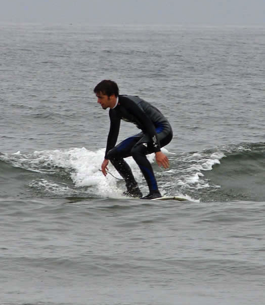

!SLIDE[bg=scene/headon.jpg]
&nbps;

.notes relax, visualize.

!SLIDE[bg=jacob/pier.jpg]
# Hello!

.notes Let's have a discussions. I don't have the answer. I'm just telling some stories, making some connections. I'm saying: this is what works for me, can you relate? Let's have a discussion about living happy productive lives.
.notes tell people to sit down

!SLIDE[bg=jacob/lalancha.jpg]
# Jacob Burkhart

!SLIDE[bg=family/jbird-pururan.jpg] center
### J-Bird

.notes J-Bird is the reason I surf. Everything I talk about we went through together.

!SLIDE[bg=scene/piersunset.jpg]
## github.com/jacobo/being_present
      
     
# @igotimac

!SLIDE

.notes This is where I work. You could too.

!SLIDE center
# What is presence?

.notes Escape existing only inside your head.

!SLIDE
# Ezekiel
# The 2 modes

!SLIDE[bg=process/katrina.jpg]
### Working Memory

!SLIDE center
# Awareness

.notes of what around you and how your body feels

!SLIDE center
# Mindfulness

.notes doing things with intention

!SLIDE center
# Focus

.notes escape the multi-tasking life

!SLIDE[bg=family/alicia.jpg]
# Know the Feeling?

.notes I won't explain the benefits of Being Present. I can only try to explain what it's like and how I get there. And maybe that will help you find your own way there.

!SLIDE[bg=gerry/pipeline.jpg]
# Gerry Lopez

.notes legendary pipeline surfer

!SLIDE[bg=bgquotes.jpg] center align-left
## Although instinct isn't the right word, something like it, along with a clear mind, work better than thinking because, at the Pipe, there isn't enough time for thought.
## A Zen-like mind that is empty of thoughts allows a strong connection with the wave.
## It lets the surfer be in touch with the wave as opposed to being apart from it.
--- Gerry Lopez

.notes Surf is where you find it: page 107

!SLIDE[bg=surfing/huntingtonbeach.png]
### Surfing
&nbps;

.notes What do you think of when I say surfing?

!SLIDE[bg=logos/birdswell.png]
&nbps;

!SLIDE[bg=surfing/huntingtonbeach2.png]
### Competition

!SLIDE[bg=surfing/slaterusopen.jpg]
&nbps;

!SLIDE[bg=surfing/alanablanchard.jpg]
### Endorsements

.notes Everyone needs marketing, I guess?

!SLIDE[bg=surfing/alanascloset.jpg]
&nbps;

!SLIDE[bg=surfing/mavs.jpg]
### Big Wave Surf

.notes like the the compiler developers and the rubinius and jruby guys. Big heavy stuff.

!SLIDE[bg=surfing/jeffclark.jpg]
&nbps;

!SLIDE[bg=surfing/danereynolds.jpg] center
### Style

!SLIDE[bg=surfing/kassiameador.jpg]
&nbps;

.notes Growing up at Malibu and surfing there, I was able to see some of the best surfers in the world. I am a very visual person. That’s why I am into photography and I really enjoy films. So aesthetically, I will just like the way someone surfs, especially if they are smooth. That’s why I like how Joel (Tudor) surfs or someone like Dane Peterson. A smooth style is something that I appreciate and I want to emulate with my surfing. I really have a difficult time watching people surf when they are just “all over the place,” I just can’t visually accept it. (laughs)

!SLIDE[bg=surfing/hippies.jpg]
### Peace
&nbps;

!SLIDE[bg=surfing/zenhippy.jpg]
&nbps;

!SLIDE[bg=friends/jorge.jpg]
### Harmony
&nbps;

!SLIDE[bg=surfing/treepose.png]
&nbps;

!SLIDE[bg=surfing/hampton-nh.jpg]
### I Started Here
&nbps;

!SLIDE
# Kook
<table>
  <tr>
    <td>
      
    </td>
    <td rowspan="100%">
      
    </td>
  </tr>
  <tr>
    <td>
      
    </td>
  </tr>
</table>

.notes Everyone starts as a beginner. But even the most experience surfers have kook moments

!SLIDE[bg=surfing/jettykooks.jpg]
# Kooking it up

.notes kooking it up sometimes means lazily catching a wave and riding it straight on, instead of going for the "down the line" maneuver.
.notes Like writing terrible terrible code on purpose just to explore something. Or to teach something.

!SLIDE
    @@@ruby
    def traversal_from_hash(from_hash)
      traversal = Proc.new do |hash_a, hash_b, opts1|
        a_vals = []
        b_vals = []
        sub_procs = [Proc.new{ "" }]
        hash_a.each do |key, value|
          if (value.is_a?(Hash) && hash_b[key].is_a?(Hash))
            sub_procs << Proc.new do |opts2|
              traversal.call(value, hash_b[key], opts2)
            end
          else
            unless hash_b[key].nil?
              a_vals << value
              b_vals << hash_b[key]
            end
          end
        end
        sub_proc = Proc.new do |opts3|
          sub_procs.collect do |sp|
            sp.call(opts3)
          end.join("")
        end
        a_vals.uniq.collect do |a_val|
          yield a_val, b_vals, sub_proc, opts1
        end
      end
    end

.notes kook programmer
.notes the simple explanation is I should have paired
.notes that harder lesson is that this code works. And it's ok to be a kook sometimes. Or rather, when you are stuck, fall back on what you know. and more on. this code was written with a puts statement between every line with lots of slow iterations.
.notes TODO: More connection to presence
.notes Usually mine involve instance_eval and going down other overly complex rabbit holes when a simple Method or Class would do just fine. This is why we pair. But also, this is healthy. This is good for us.  The ocean always wins and humility is healthy.

!SLIDE[bg=gerry/yoga.jpg]
# Gerry Lopez
                 
(not a Kook)

!SLIDE[bg=bgquotes.jpg] center align-left
## The answer may be so simple that it is easily overlooked.
## If one believes that the truth lies within, faith dictates that it will reveal itself when it is most needed.
## It's there, so keep padding where it leads.
--- Gerry Lopez

.notes Surf is where you find it page 128.  Gerry tells the story of riding giant unpredictable waves in G-Land. http://en.wikipedia.org/wiki/G-Land

!SLIDE[bg=ed/stylecrouch.jpg]
# Getting to the next level

!SLIDE[bg=scene/mainewinter.jpg]
# Dedication

.notes I've taken many people out for their first surf. Or first few surfs. Only a few have truly taken to it.  Made it a priority.

!SLIDE[bg=scene/bocabarranca.jpg]
# Priorities

!SLIDE[bg=scene/foggymontara.jpg] bullets incremental
# The 5 Priorities
* Faith
* Health
* Family
* Friends
* Work

.notes I don't have the great big grey Gandalf beard up here to really sell this to you like it's a lifetime of wisdom. But I buy into it.

!SLIDE[bg=faith/buddha.jpg]
&nbsp;

.notes Buddha. The original Zen master.  Life story is basically. Extreme Decadence, Extreme Piety. The Middle Path.

!SLIDE[bg=friends/jorge2.jpg]
# Balance

.notes Balance. this is an ordered list, but there are no absolutes.  Friends don't ALWAYS take priority over work. There is balance

!SLIDE[bg=jacob/esterillos.jpg]
### Faith = Surf

.notes Faith means many thinks to different people. To me it's surfing.  It's that rare sense of connection with the universe.
.notes this is an assignment, not an assertion. I've chosen this assignment for my faith.

!SLIDE[bg=gerry/patagonia.jpg]
&nbsp;

.notes characteristic smile picture

!SLIDE[bg=bgquotes.jpg] center align-left
## Anytime I go surfing can be a religious experience if I let it. It is a close encounter with one of our world's greatest natural wonders.
## Out here on the edge of the known world, far from the distractions of civilization, I can more easily find this space.
## But in reality any of us can find it anywhere, because we carry it inside us everywhere we go.
--- Gerry Lopez

.notes page 166

!SLIDE[bg=family/jbirdwin.jpg]
### Health

.notes Surfing is good for you

!SLIDE[bg=jacob/handstand.jpg]
### Morning Exercise
                 
Bipedalism

!SLIDE[bg=surfing/paddling.jpg]
### Wrist Strength

.notes good for your wrists. TODO: good for so many thing
.notes Vitamin D

!SLIDE[bg=family/thanksgiving.jpg]
### Family

!SLIDE[bg=family/shiva.jpg]
### Prioritizing Surf

.notes Shiva. Not the indian God, just the middle name my Yoga-obsessed aunt gave to my cousin. Which he now goes by Took my on my first Surf. He was living in a shack his artist friend built, with ilegal plumbing. Over worked as an architect, on the fritz with his girlfriend at the time. Surfing every morning. Loving Life.

!SLIDE[bg=family/jbird.jpg]
### Sharing the Stoke
&nbsp;

.notes J-Bird. My lifelong surf companion. My Wife. An Obsession with perfection.  And with surfing.
A roller-coaster of emotion as an Addict who rages at the need to surf. And is SOO excited when she finally catches that first wave. Her stoke never fades.

!SLIDE[bg=friends/beachkooks.jpg]
### Friends

!SLIDE[bg=friends/cynthia.jpg]
### Addiction

.notes Cynthia: Surfing is My Drug

!SLIDE[bg=friends/chris.jpg]
### Sanity

.notes Chris: Surfing keeps me sane (or less insane)

!SLIDE[bg=friends/post-mago-surf.jpg]
### Post-Mango Surf

!SLIDE[bg=friends/perin.jpg]
### Patience

.notes patience
.notes "No other thoughts in my head"

!SLIDE[bg=work/thom.jpg]
### Work
&nbsp;

.notes TODO: no child labor
.notes surf before you go to work

!SLIDE[bg=ed/yellow.jpg] align-left
# Ed

.notes I knew him as "Director of engineering". Opened my eyes to surfing new places, exploring. Surfing in the winter. Trying new boards One of the first time's Ed and I surfed together I can only recently started at Brontes.  He asked me "How are things"? I said "which, work? or surf?" He replied, oh well surf I guess. Clearly you understand what's more important.
.notes It's critical to always mix work and surfing. The yellow board, a big hull shaped by Ryan Lovelace, was picked up while I was in LA, repairing COSs and meeting customers. I rode it at Ricon, County Line, Topanga Canyon and Cardiff Reef. In between each session, I repaired a COS. It's more complicated than sending a tech or paying shipping on a new board, but, that's far less satisfying.
.notes The yellow board, was picked up while I was in LA. I rode it at Ricon, County Line, Topanga Canyon and Cardiff Reef.
.notes In between each session, I repaired a COS.

!SLIDE[bg=bgquotes.jpg] center align-left
## It's critical to always mix work and surfing.
## The yellow board was picked up while I was in LA, repairing COSs and meeting customers.
## ... It's more complicated than sending a tech or paying shipping on a new board, but, that's far less satisfying.
--- Ed

!SLIDE[bg=scene/sanpancho.jpg]
# Surf Lifestyle

!SLIDE[bg=scene/phillipine-sunrise.jpg]
### Wake up at 6
                 
(J-Bird drags me out of Bed at 6)

!SLIDE[bg=scene/lindamar.jpg]
### In the water by 7

!SLIDE[bg=scene/dunes.jpg]
### Out by 9

!SLIDE[bg=jacob/surf-shower.jpg]
### Quick Shower

!SLIDE[bg=work/standup.jpg]
### Standup at 10

!SLIDE[bg=jacob/lunch.jpg]
### The Massive Lunch

!SLIDE[bg=jacob/layback.jpg]
# Pura Vida

.notes pair says: OMG this bug or this problem :-( I say: OMG this bug! :-) It's so interesting. So intriguing. why why why. how how how.

!SLIDE[bg=bgquotes.jpg] center align-left
## Such is the life we can know.
## Living in the past and in the future - in recollection and in anticipation - creates a less clear picture of the present.
## By being in the here and now we understand that the past and future only exist in the present.
--- Gerry Lopez

.notes quote by Gerry Lopez. He was talking about his experience big wave surfing. Fortunately for me, I can get this feeling from less life-threatening situations.

!SLIDE[bg=scene/greywhale.jpg] center
# What is your source of presence?

!SLIDE[bg=westport/beach.png]
### Westport

!SLIDE[bg=westport/map.png]
&nbsp;

!SLIDE[bg=westport/surfshop.jpg]
&nbsp;

!SLIDE[bg=scene/santacruz.jpg]
# Santa Cruz

.notes The long peeling waves. Sweet Sweet longboard rides. Otters! But the people :-(

!SLIDE[bg=scene/pointbreakaggro.png]
# Don't be Aggro!

.notes Application to programmers: Welcome and encourage new ideas. Be constructive not negative. We don't do this face to face, but we see it anonymized online all the time. "Haters hating" A style that is not yours doesn't means it's wrong.

!SLIDE[bg=surfing/twiggy.png]
#Don't panic after you've panicked

.notes Grant 'twiggy' Baker.  Stuff breaks in production. You might freak out. But then you must calmly 

!SLIDE[bg=bgquotes.jpg] center align-left
## Moments of surf realization are here to remind us of our true potential.
## If that is why we surf, that's good because surfing reconnects us to who we really are. 
## This is all more reason to keep surfing. 
## Life is good. Surfing reminds us of how good life is.
--- Gerry Lopez

.notes page 115

!SLIDE[bg=scene/bird.jpg]
### Musical Finale

!SLIDE
### Extra Time

!SLIDE[bg=scene/cowells.jpg]
### Surf etiquette

!SLIDE[bg=scene/morocco.jpg]
# Priority to the peak
Don't drop in. Your chance will come.

.notes There's always another wave.

!SLIDE[bg=surfing/controlyourboard.jpg]
# Control your board
Be accountable

.notes Be accountable.

!SLIDE[bg=friends/rich.jpg]
### Ding Repair
Accidents happen

.notes Fix them. Get a professional to help you.

!SLIDE[bg=family/dad.jpg]
### Aloha
Share and Encourage

.notes Cheer for strangers. Share the waves.

!SLIDE[bg=surfing/holddown.jpg]
### The Hold Down
Relaxing under Stress

!SLIDE[bg=jacob/safari.jpg]
### Weekend Surf Safari

.notes Lets go surfin now. Everybodys learning how. Come on and safari with me.

!SLIDE[bg=scene/tunitas.jpg]
# The Coastline

.notes Marin county. The usual weekday breaks. State Parks.  Santa Cruz

!SLIDE[bg=scene/bird.jpg]
### Musical Finale
